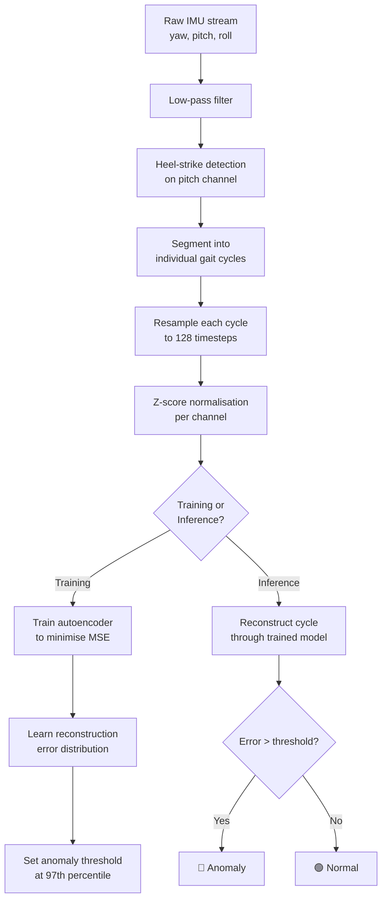

# Gait Anomaly Detection with a 1D Convolutional Autoencoder

A personal project built with [@dhia9](https://github.com/dhia9) to learn how autoencoders work by applying one to a real problem: detecting walking anomalies from shoe-insert IMU data, without any labelled training examples.

---

## Why we built this

[@dhia9](https://github.com/dhia9) and I had access to Euler-angle data (yaw, pitch, roll) from a connected shoe insert's IMU sensor, and we wanted to understand how neural networks can learn patterns from unlabelled data. Gait analysis seemed like a perfect fit because walking is highly periodic, so a model that learns what "normal" looks like should be able to spot when something is off.

The key insight that made this click for us: you don't need to know what every type of anomaly looks like. You just need enough normal data. The autoencoder learns to compress and reconstruct normal gait cycles, and when it sees something it hasn't learned, the reconstruction falls apart. That high reconstruction error *is* your anomaly signal.

### Why an autoencoder over other approaches?

| Approach | Requires labels? | Strengths |
|---|---|---|
| Supervised classifier | Yes, hundreds per class | High accuracy once data exists |
| **Autoencoder (this project)** | **No** | **Works right away with only normal data** |
| Isolation Forest / One-Class SVM | No | Simpler, but weaker on temporal patterns |

We went with the autoencoder because it captures the temporal shape of each stride through 1D convolutions, and we didn't have any labelled anomaly data to start with. It also produces a 32-dimensional latent embedding per cycle, which turned out to be really useful for visualisation and clustering.

---

## How it works



The pipeline breaks down into five steps:

1. **Segment** the continuous angle stream into individual gait cycles using heel-strike detection on the pitch channel.
2. **Resample** each variable-length cycle to a fixed 128-timestep window.
3. **Normalise** per channel (z-score) using training-set statistics.
4. **Train** the autoencoder to minimise MSE reconstruction error on normal cycles.
5. **Flag** new cycles whose reconstruction error exceeds the threshold.

---

## Model architecture

```
Encoder                                    Decoder
────────────────────                       ────────────────────
Conv1d(3→32,  k=7, s=2)  → (32,  64)      ConvT1d(256→128, k=3, s=2) → (128, 16)
Conv1d(32→64, k=5, s=2)  → (64,  32)      ConvT1d(128→64,  k=3, s=2) → (64,  32)
Conv1d(64→128,k=3, s=2)  → (128, 16)      ConvT1d(64→32,   k=5, s=2) → (32,  64)
Conv1d(128→256,k=3,s=2)  → (256,  8)      ConvT1d(32→3,    k=7, s=2) → (3,  128)
Flatten → Linear → z (32)                 Linear → Reshape (256, 8)
```

Every conv block uses BatchNorm and LeakyReLU. The decoder mirrors the encoder with transposed convolutions. The bottleneck is a 32-d latent vector, which doubles as a compact gait embedding you can feed into downstream tasks like clustering or a supervised classifier later on.

---

## Input data format

A CSV file with four columns:

| Column | Type | Description |
|---|---|---|
| `Relative timestamp` | float | Time in seconds from recording start |
| `yaw` | float | Yaw angle in degrees |
| `pitch` | float | Pitch angle in degrees |
| `roll` | float | Roll angle in degrees |

Sampling rates anywhere from 50 to 200 Hz work fine. The pipeline figures out the rate from the timestamps automatically.

---

## Getting started

### Requirements

```
python >= 3.9
torch >= 2.0
numpy
pandas
scipy
matplotlib
scikit-learn
```

Install everything with:

```bash
pip install torch numpy pandas scipy matplotlib scikit-learn
```

### Run the notebook

```bash
jupyter notebook gait_autoencoder.ipynb
```

The notebook ships with a **synthetic data generator** that creates a realistic 2-minute IMU recording and injects a few fake anomalies (foot drop, asymmetry, stumble). This lets you run the full pipeline end-to-end before you have any real data, which was really helpful for debugging.

When you're ready to use your own recordings, just uncomment the data-loading cell:

```python
DATA_PATH = Path("your_recording.csv")
df = pd.read_csv(DATA_PATH)
```

---

## Configuration

All the tuneable parameters live in a single cell at the top of the notebook:

| Parameter | Default | Description |
|---|---|---|
| `SAMPLING_RATE` | 100 | IMU sampling frequency (Hz) |
| `CYCLE_LENGTH` | 128 | Resampled timesteps per gait cycle |
| `MIN_STRIDE_SAMPLES` | 50 | Minimum samples between heel strikes |
| `PITCH_PEAK_PROMINENCE` | 8.0 | Peak prominence for heel-strike detection (°) |
| `LOWPASS_CUTOFF` | 15.0 | Low-pass filter cutoff (Hz), set to 0 to disable |
| `LATENT_DIM` | 32 | Autoencoder bottleneck dimension |
| `BATCH_SIZE` | 64 | Training batch size |
| `EPOCHS` | 120 | Maximum training epochs |
| `LR` | 1e-3 | Adam learning rate |
| `PATIENCE` | 15 | Early-stopping patience (epochs) |
| `ANOMALY_PERCENTILE` | 97 | Threshold percentile on reconstruction error |

If you're working with a new sensor, the first things to tune are `PITCH_PEAK_PROMINENCE` and `MIN_STRIDE_SAMPLES`. These control how the pipeline chops the signal into gait cycles, and they depend on how your IMU is mounted and its sampling rate. There's a visualisation cell that plots the detected peaks over the pitch signal so you can check if the segmentation looks right.

---

## What the notebook covers

1. **Data loading** with a synthetic generator and real CSV loader
2. **Signal visualisation** of the full recording and a zoomed stride view
3. **Low-pass filtering** with an optional Butterworth filter
4. **Gait cycle segmentation** via heel-strike detection on the pitch channel
5. **Resampling and normalisation** to fixed-length cycles with z-score scaling
6. **Autoencoder training** with MSE loss, early stopping, and learning-rate scheduling
7. **Anomaly detection** from the reconstruction error distribution
8. **Diagnostics** including per-channel error breakdown, reconstruction overlays, and t-SNE of the latent space
9. **Inference pipeline** with a ready-to-use `analyse_recording()` function for new CSVs
10. **Model checkpointing** that saves and loads the model along with all preprocessing statistics

---

## Data requirements

| Stage | What you need | Volume |
|---|---|---|
| **Unsupervised (this notebook)** | Normal walking recordings | 20 to 50 subjects, 2 to 5 min each (~5k to 10k cycles) |
| **Supervised (future work)** | Labelled anomaly examples | 200 to 500+ cycles per anomaly class |

Diversity in the normal data matters more than sheer volume. If everyone in your training set is the same age and height walking at the same speed, the model will think anything outside that narrow profile is an anomaly.

---

## Roadmap / ideas for future work

- [x] 1D convolutional autoencoder with unsupervised anomaly detection
- [x] Heel-strike segmentation and fixed-length resampling
- [x] Per-channel error decomposition for anomaly interpretation
- [x] t-SNE latent-space visualisation
- [x] End-to-end inference function
- [ ] Variational autoencoder (VAE) variant for smoother latent spaces
- [ ] Multi-cycle temporal context (feeding 3 to 5 consecutive strides as input)
- [ ] Active labelling interface for clinical review of flagged cycles
- [ ] Supervised classification head on top of the latent embeddings
- [ ] Precision/recall threshold tuning once labelled data is available
- [ ] Real-time inference for live gait monitoring

---

## Project structure

```
.
├── gait_autoencoder.ipynb          # Main notebook (English)
├── gait_autoencoder_fr.ipynb       # Main notebook (French)
├── README.md
├── checkpoints/
│   └── gait_autoencoder.pt         # Saved model + preprocessing stats
└── data/
    └── your_recording.csv          # Your IMU recordings go here
```

---

## What we learned

This was our first real project with autoencoders, and a few things surprised us. The hardest part wasn't the neural network itself; it was getting the gait cycle segmentation right. If the heel-strike detection is off, you feed the model garbage and no amount of training fixes it. The segmentation visualisation cell ended up being the most important debugging tool in the whole notebook.

We also didn't expect the t-SNE plot to be so informative. You can actually see natural clusters forming in the latent space (probably corresponding to different walking speeds or left vs. right foot), and the anomalies clearly sit outside those clusters. It made the whole thing feel less like a black box.

If you're trying to learn about autoencoders too, we'd recommend starting with the synthetic data and just playing around with the latent dimension and the number of conv layers. You can really feel how the model's capacity affects what it can and can't reconstruct.

---

## License

MIT
