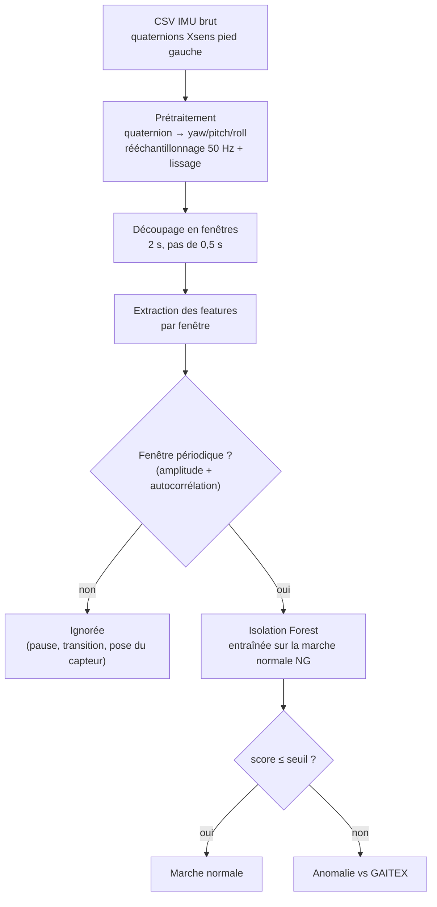
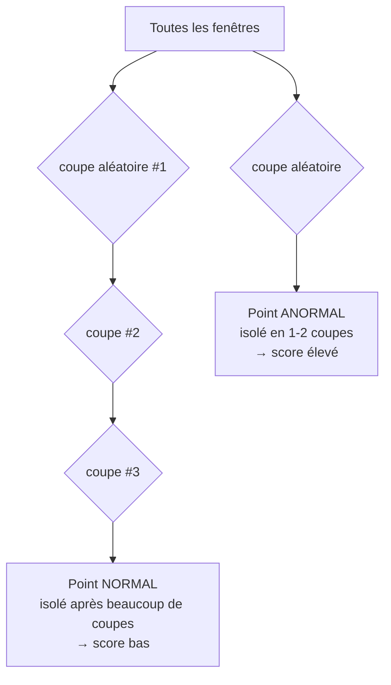

# MVP IMU - Détection d'anomalies de marche

Projet étudiant réalisé en collaboration avec [@dhia9](https://github.com/dhia9) sur GitHub.
L'objectif : montrer, avec les connaissances vues en cours (Python, traitement du signal, machine learning non supervisé), qu'une centrale inertielle (IMU) placée sous la semelle gauche suffit à repérer une marche qui s'écarte de la marche normale de référence.

## Crédits : jeu de données GAITEX

Les données de marche utilisées dans ce projet proviennent du jeu de données public
**GAITEX**, mis à disposition par ses auteurs. Tous nos remerciements à eux.

> Spilz, A., Oppel, H., Werner, J., Stucke-Straub, K., Capanni, F. & Munz, M.
> **GAITEX: Human motion dataset of impaired gait and rehabilitation exercises using
> inertial and optical sensors.** *Scientific Data* **13**, 11 (2025).
> https://doi.org/10.1038/s41597-025-06439-x


## D'où vient le projet

On est partis d'un jeu de données réel d'IMU Xsens (capteur du pied gauche). Deux
situations sont enregistrées : `data/ng/` = marche normale, `data/gwo/` = marche avec
orthèse. Plutôt que d'apprendre à reconnaître chaque pathologie (on n'a pas assez
d'exemples « anormaux »), on a choisi une approche **non supervisée** : le modèle
n'apprend que ce qu'est une marche *normale*, et tout ce qui s'en éloigne est signalé
comme anomalie. C'est simple, honnête vis-à-vis des données disponibles, et ça reste
explicable; ce qu'on cherchait pour un projet d'école.

## Le pipeline en un schéma



On ne score que les fenêtres qui « ressemblent » à de la marche rythmique : une pause,
une transition ou la pose du capteur ne sont pas comptées comme des anomalies.

## C'est quoi une *feature* ?

Une **feature** (ou *caractéristique*) est un nombre qui résume une propriété utile du
signal. Un algorithme de ML ne sait pas lire directement une courbe d'angle de
1 000 points ; on lui fournit donc, pour chaque fenêtre de 2 secondes et chaque axe
(yaw, pitch, roll), des résumés statistiques et de forme :

| Feature | Ce qu'elle mesure |
|---|---|
| `mean`, `std`, `min`, `max` | niveau et dispersion de l'angle |
| `amplitude` | écart max − min (ampleur du mouvement) |
| `rms` | énergie du signal |
| `velocity_std` | régularité de la vitesse angulaire |
| `periodicity`, `period_s` | à quel point le mouvement est rythmé (autocorrélation) et la durée d'un cycle |
| `yaw_pitch_corr`, … | corrélation entre deux axes (coordination du pied) |

Une marche anormale (pronation, marche sur les pointes…) modifie ces valeurs, et c'est
exactement ce que le modèle apprend à repérer.

## C'est quoi une *Isolation Forest* ?

L'**Isolation Forest** est un modèle de détection d'anomalies. L'idée est intuitive :
**un point anormal est facile à isoler.**

L'algorithme construit beaucoup d'arbres (`n_estimators=300`). Pour chaque arbre, il
choisit au hasard une feature et un seuil, coupe les données en deux, et recommence
jusqu'à isoler chaque point. Un point « normal », noyé dans la masse, demande
**beaucoup de découpes** avant d'être isolé. Un point atypique, à l'écart des autres,
est isolé en **très peu de découpes**.



Le **score d'anomalie** = profondeur moyenne d'isolement sur tous les arbres. Plus c'est
court, plus c'est suspect. Avantage clé pour nous : **on n'a besoin que d'exemples
normaux** pour l'entraîner (ici uniquement `data/ng/`). Avant l'arbre, un
`StandardScaler` met toutes les features à la même échelle.

## Installation

```bash
pip install -r requirements.txt
```

## Commandes

```bash
# 1. Préparer les CSV NG et GWO
python src/prepare_data.py

# 2. (option) Générer des marches synthétiques de démo (pronation, supination…)
python src/generate_sample_data.py

# 3. Entraîner Isolation Forest sur la marche normale
python src/model.py --train

# 4. Scorer un fichier en ligne de commande
python src/scoring.py --model artifacts/model.joblib \
    --input data/processed/gaitex_test_gwo_left_foot.csv \
    --output artifacts/scores.csv

# 5. Lancer l'interface
streamlit run app/streamlit_app.py
```

## Format CSV accepté

L'application accepte soit :

- des angles déjà calculés : `time_s,yaw,pitch,roll` ;
- les quaternions Xsens de la semelle gauche `XSens_Foot_Left_QX/QY/QZ/QW` (+ une
  colonne de temps), convertis automatiquement en angles.

## Avertissement

Le score indique un **écart par rapport à la norme GAITEX**. Ce n'est **pas un
diagnostic médical** et le modèle ne classe pas le type précis d'anomalie : il dit
seulement « cette fenêtre de marche ressemble, ou non, à une marche normale ».
